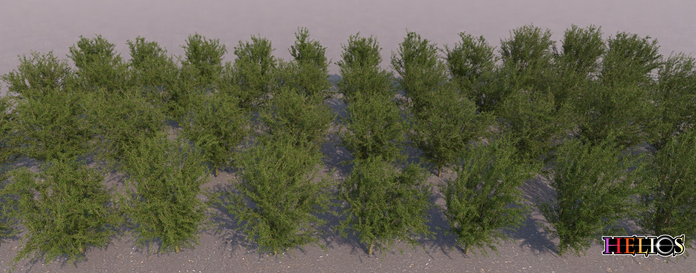

  

For complete documentation of this software, please consult <a href="https://baileylab.ucdavis.edu/software/helios">https://baileylab.ucdavis.edu/software/helios, or open the file doc/html/index.html in a web browser.

Helios is a C++ API for 3D physical simulation of plant and environmental systems. In order to build and compile the core library, you will need to install a C/C++ compiler (recommended are the GNU C compilers version 5.5+), and CMake. In order to run many of the model plug-ins, you will need to install NVIDIA CUDA 9.0+, and a GPU with compute capability 3.5+. The software has been tested on Linux, Mac, and Windows platforms.

